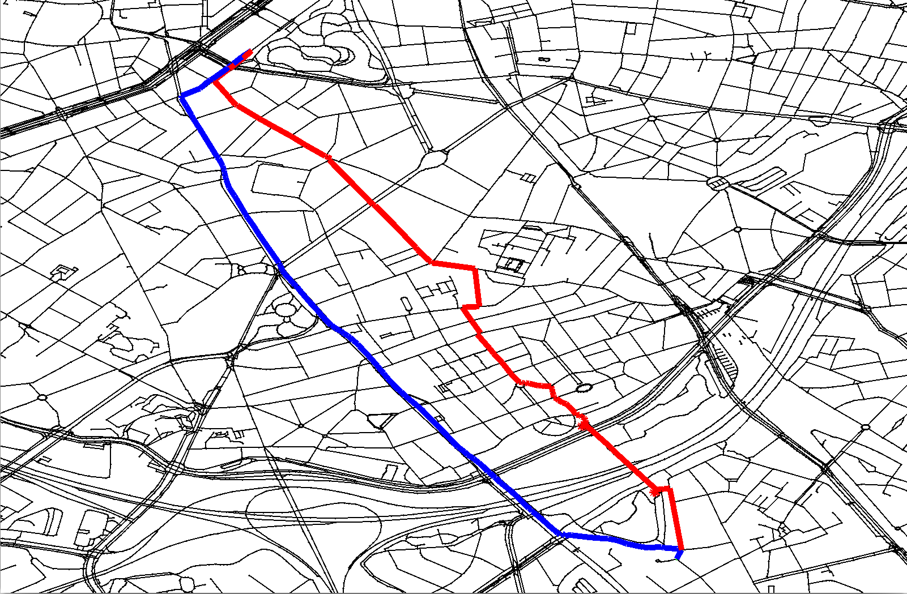

# Optimal route planner
This project parses an OSM file exported using the OpenStreetMap export tool
and create a graph from this data. It allows to calculate the shortest path 
between two coordinates in this graph, calculates the path length and 
visualizes the result.

Graph processing is based on the GraphStream library.

## Example

## Quickstart
Install the [Mill](http://www.lihaoyi.com/mill/) build tool for scala and 
run `mill optimalRoute.run` to run the application. Navigate the map using 
the arrow keys and Page up and down to zoom.